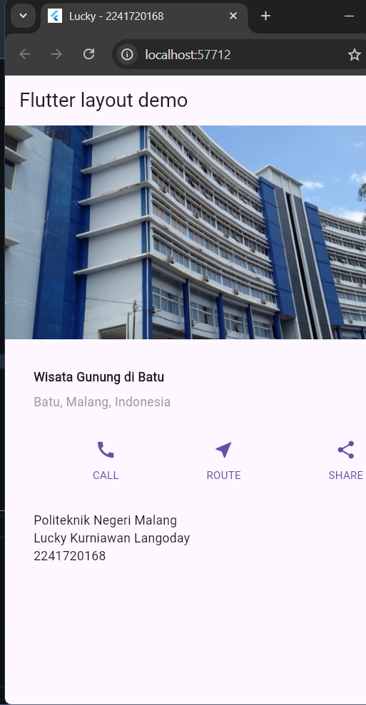
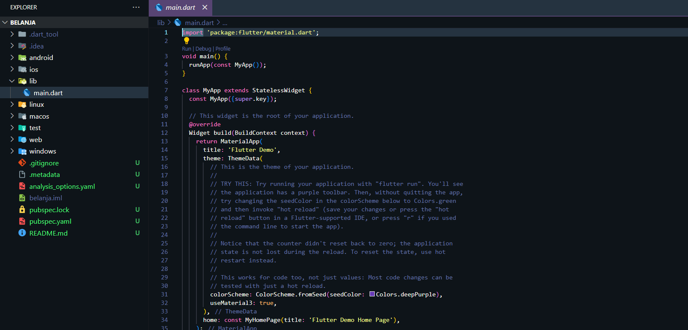
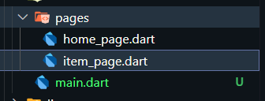
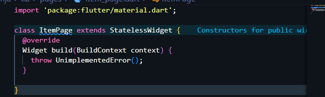
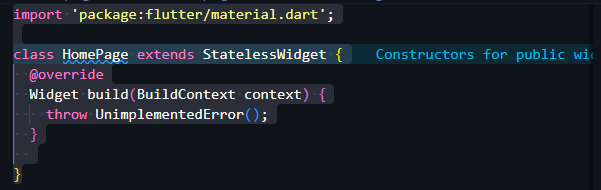
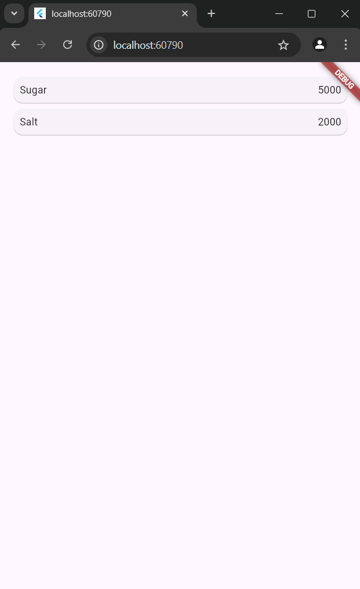
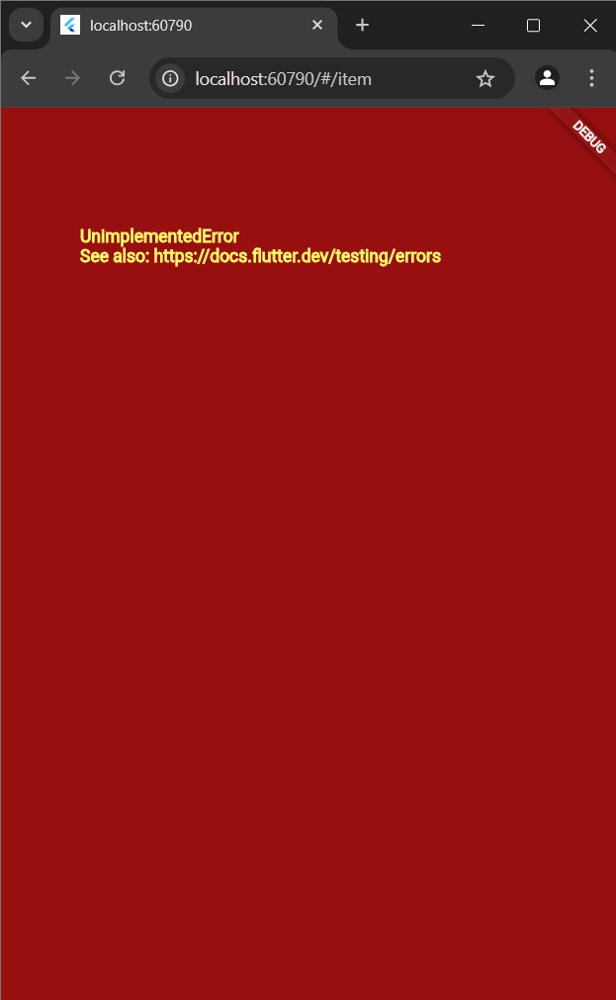
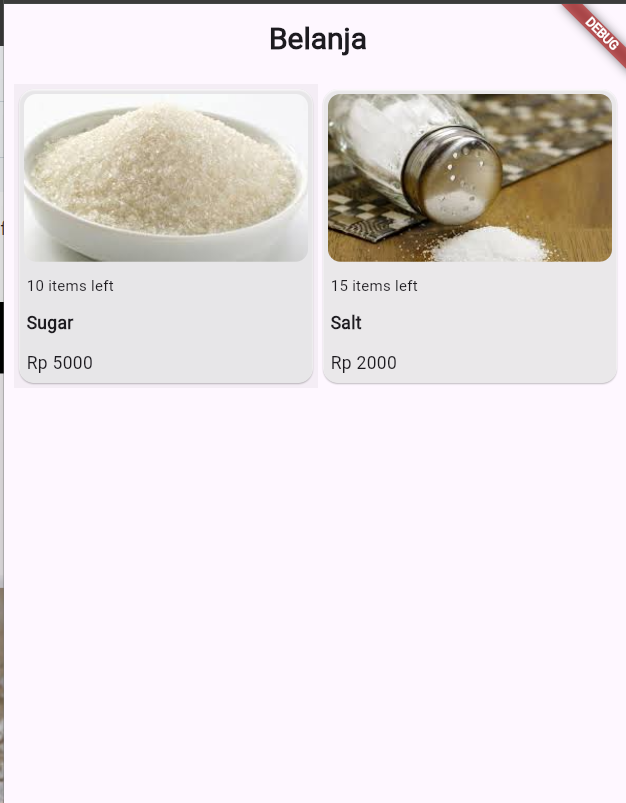
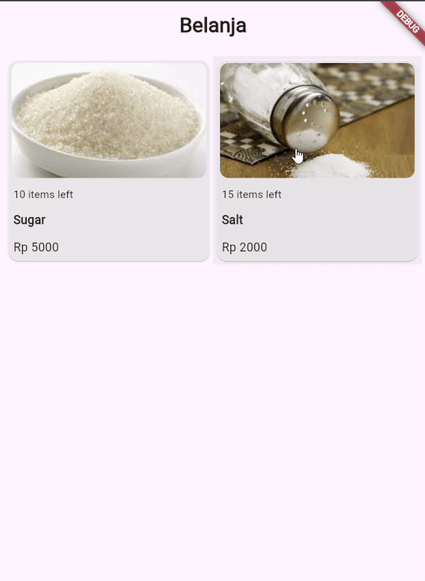
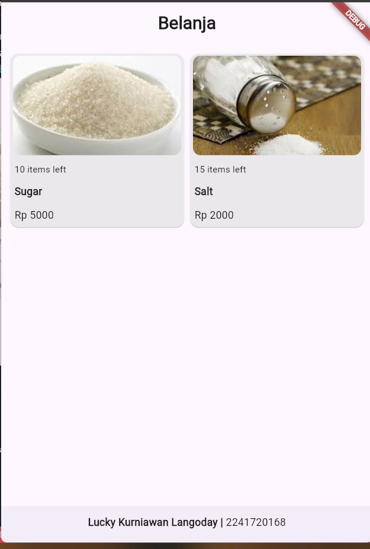

| Nama  | Lucky Kurniawan Langoday |
| ----- | ------------------------ |
| Kelas | TI-3D                    |
| Absen | 13                       |
| NIM   | 2241720168               |

# 06 | Layout dan Navigasi

## Praktikum 1

### Langkah 2: Buka file lib/main.dart

Buka file main.dart lalu ganti dengan kode berikut. Isi nama dan NIM Anda di text title.

```
import 'package:flutter/material.dart';

void main() => runApp(const MyApp());

class MyApp extends StatelessWidget {
  const MyApp({super.key});

  @override
  Widget build(BuildContext context) {
    return MaterialApp(
      title: 'Flutter layout: Nama dan NIM Anda',
      home: Scaffold(
        appBar: AppBar(
          title: const Text('Flutter layout demo'),
        ),
        body: const Center(
          child: Text('Hello World'),
        ),
      ),
    );
  }
}
```

### Langkah 4: Implementasi title row

Pertama, Anda akan membuat kolom bagian kiri pada judul. Tambahkan kode berikut di bagian atas metode build() di dalam kelas MyApp:

```
Widget titleSection = Container(
    padding: const EdgeInsets.all(32),
    child: Row(
      children: [
        Expanded(
          /* soal 1*/
          child: Column(
            crossAxisAlignment: CrossAxisAlignment.start,
            children: [
              /* soal 2*/
              Container(
                padding: const EdgeInsets.only(bottom: 8),
                child: const Text(
                  'Wisata Gunung di Batu',
                  style: TextStyle(
                    fontWeight: FontWeight.bold,
                  ),
                ),
              ),
              Text(
                'Batu, Malang, Indonesia',
                style: TextStyle(
                  color: Colors.grey[500],
                ),
              ),
            ],
          ),
        ),
        /* soal 3*/
        Icon(
          Icons.star,
          color: Colors.red[500],
        ),
        const Text('41'),
      ],
    ),
  );
```

## Praktikum 2

### Langkah 1: Buat method Column \_buildButtonColumn

```
Column _buildButtonColumn(Color color, IconData icon, String label) {
    return Column(
      mainAxisSize: MainAxisSize.min,
      mainAxisAlignment: MainAxisAlignment.center,
      children: [
        Icon(icon, color: color),
        Container(
          margin: const EdgeInsets.only(top: 8),
          child: Text(
            label,
            style: TextStyle(
              fontSize: 12,
              fontWeight: FontWeight.w400,
              color: color,
            ),
          ),
        ),
      ],
    );
  }
```

### Langkah 2: Buat widget buttonSection

Tambahkan kode berikut tepat di bawah deklarasi titleSection di dalam metode build():

```
Color color = Theme.of(context).primaryColor;

Widget buttonSection = Row(
  mainAxisAlignment: MainAxisAlignment.spaceEvenly,
  children: [
    _buildButtonColumn(color, Icons.call, 'CALL'),
    _buildButtonColumn(color, Icons.near_me, 'ROUTE'),
    _buildButtonColumn(color, Icons.share, 'SHARE'),
  ],
);
```

### Langkah 3: Tambah button section ke body

Tambahkan variabel buttonSection ke dalam body seperti berikut:

```
home: Scaffold(
        appBar: AppBar(
          title: const Text('Flutter layout demo'),
        ),
        body: Column(
          children: [
            titleSection,
            buttonSection,
          ],
        )
    )
```
## Praktikum 3
### Langkah 1: Buat widget textSection
Tambahkan kode berikut tepat di bawah deklarasi buttonSection:
```
 Widget textSection = Container(
      padding: const EdgeInsets.all(32),
      child: const Text(
        'Politeknik Negeri Malang \n'
        'Lucky Kurniawan Langoday \n'
        '2241720168',
        softWrap: true,
      ),
    );
```
### Langkah 2: Tambahkan variabel text section ke body
Tambahkan widget variabel textSection ke dalam body seperti berikut:
```
children: [
            Image.asset(
              'assets/polinema.jpeg',
              width: 600,
              height: 240,
              fit: BoxFit.cover,
            ),
            titleSection,
            buttonSection,
            textSection,
          ],
```
## Praktikum 4
### Langkah 1: Siapkan aset gambar
Anda dapat mencari gambar di internet yang ingin ditampilkan. Buatlah folder images di root project layout_flutter. Masukkan file gambar tersebut ke folder images, lalu set nama file tersebut ke file pubspec.yaml seperti berikut:
```
  # To add assets to your application, add an assets section, like this:
  assets:
    - assets/
```
### Langkah 2: Tambahkan gambar ke body
Tambahkan aset gambar ke dalam body seperti berikut:
```
children: [
            Image.asset(
              'assets/polinema.jpeg',
              width: 600,
              height: 240,
              fit: BoxFit.cover,
            ),
]
```
### Langkah 3: Terakhir, ubah menjadi ListView
Pada langkah terakhir ini, atur semua elemen dalam ListView, bukan Column, karena ListView mendukung scroll yang dinamis saat aplikasi dijalankan pada perangkat yang resolusinya lebih kecil.
```
 body: ListView(
          children: [
            Image.asset(
              'assets/polinema.jpeg',
              width: 600,
              height: 240,
              fit: BoxFit.cover,
            ),
            titleSection,
            buttonSection,
            textSection,
          ],
        ),
```
### hasil akhir
        


## Praktikum 5
### Langkah 1: Siapkan project baru
Sebelum melanjutkan praktikum, buatlah sebuah project baru Flutter dengan nama belanja dan susunan folder seperti pada gambar berikut. Penyusunan ini dimaksudkan untuk mengorganisasi kode dan widget yang lebih mudah.
        

### Lanngkah 2: Mendefinisikan Route
Buatlah dua buah file dart dengan nama home_page.dart dan item_page.dart pada folder pages. Untuk masing-masing file, deklarasikan class HomePage pada file home_page.dart dan ItemPage pada item_page.dart. Turunkan class dari StatelessWidget. Gambaran potongan kode dapat anda lihat sebagai berikut. <br>
 
 
 

### Langkah 3: Lengkapi Kode di main.dart
Setelah kedua halaman telah dibuat dan didefinisikan, bukalah file main.dart. Pada langkah ini anda akan mendefinisikan Route untuk kedua halaman tersebut. Definisi penamaan route harus bersifat unique. Halaman HomePage didefinisikan sebagai /. Dan halaman ItemPage didefinisikan sebagai /item. Untuk mendefinisikan halaman awal, anda dapat menggunakan named argument initialRoute. Gambaran tahapan ini, dapat anda lihat pada potongan kode berikut. <br>
```
void main() {
  runApp(MaterialApp(
    initialRoute: '/',
    routes: { 
      '/': (context) => HomePage(),
      '/item': (context) => ItemPage(),

    },
  ));
}
```
### Langkah 4: Membuat data model
Sebelum melakukan perpindahan halaman dari HomePage ke ItemPage, dibutuhkan proses pemodelan data. Pada desain mockup, dibutuhkan dua informasi yaitu nama dan harga. Untuk menangani hal ini, buatlah sebuah file dengan nama item.dart dan letakkan pada folder models. Pada file ini didefinisikan pemodelan data yang dibutuhkan. Ilustrasi kode yang dibutuhkan, dapat anda lihat pada potongan kode berikut.
```
class Item {
  String name;
  int price;

  Item({required this.name, 
  required this.price});
}
```
### Langkah 5: Lengkapi kode di class HomePage
Pada halaman HomePage terdapat ListView widget. Sumber data ListView diambil dari model List dari object Item. Gambaran kode yang dibutuhkan untuk melakukan definisi model dapat anda lihat sebagai berikut.
```
const HomePage({Key? key}) : super(key: key);
  
  @override
  Widget build(BuildContext context) {
    final List<Item> items = [
      Item(
        name: 'Sugar',
        price: 5000, 
        
      ),
      Item(
        name: 'Salt',
        price: 2000,
        
      ),
    ];

    return Scaffold();
  }
```
### Langkah 6: Membuat ListView dan itemBuilder
Untuk menampilkan ListView pada praktikum ini digunakan itemBuilder. Data diambil dari definisi model yang telah dibuat sebelumnya. Untuk menunjukkan batas data satu dan berikutnya digunakan widget Card. Kode yang telah umum pada bagian ini tidak ditampilkan. Gambaran kode yang dibutuhkan dapat anda lihat sebagai berikut.
```
return SafeArea(
      child: Scaffold(
        //appBar: customAppBar('Belanja'),
        body: Container(
          margin: EdgeInsets.all(8),
          child: ListView.builder(
            padding: EdgeInsets.all(8),
            itemCount: items.length,
            itemBuilder: (context, index) {
              final item = items[index];
              return Card(
                child: Container(
                  margin: EdgeInsets.all(8),
                  child: Row(
                    children: [
                      Expanded(child: Text(item.name)),
                      Expanded(
                        child: Text(
                          item.price.toString(),
                          textAlign: TextAlign.end,
                        ),
                      )
                    ],
                  ),
                ),
              );
            },
          ),
        ),
      ),
    );
  
```
Jalankan aplikasi pada emulator atau pada device anda. <br>


### Langkah 7: Menambahkan aksi pada ListView
Item pada ListView saat ini ketika ditekan masih belum memberikan aksi tertentu. Untuk menambahkan aksi pada ListView dapat digunakan widget InkWell atau GestureDetector. Perbedaan utamanya InkWell merupakan material widget yang memberikan efek ketika ditekan. Sedangkan GestureDetector bersifat umum dan bisa juga digunakan untuk gesture lain selain sentuhan. Pada praktikum ini akan digunakan widget InkWell.

Untuk menambahkan sentuhan, letakkan cursor pada widget pembuka Card. Kemudian gunakan shortcut quick fix dari VSCode (Ctrl + . pada Windows atau Cmd + . pada MacOS). Sorot menu wrap with widget... Ubah nilai widget menjadi InkWell serta tambahkan named argument onTap yang berisi fungsi untuk berpindah ke halaman ItemPage. Ilustrasi potongan kode dapat anda lihat pada potongan berikut.
```
 return InkWell(
                onTap: () {
                  Navigator.pushNamed(context, '/item');
                },
 )
 ```
 Jalankan aplikasi kembali dan pastikan ListView dapat disentuh dan berpindah ke halaman berikutnya. Periksa kembali jika terdapat kesalahan. <br>
 

 ## Tugas Praktikum 2 no 3
 Pada hasil akhir dari aplikasi belanja yang telah anda selesaikan, tambahkan atribut foto produk, stok, dan rating. Ubahlah tampilan menjadi GridView seperti di aplikasi marketplace pada umumnya.
 ```
 class Item {
  String name;
  int price;
  String foto;
  double rating;
  int stok;

  Item({required this.name, 
        required this.price,
        required this.foto,
        required this.rating,
        required this.stok});
}
```


## Tugas Praktikum 2 no 4
Silakan implementasikan Hero widget pada aplikasi belanja Anda dengan mempelajari dari sumber ini: https://docs.flutter.dev/cookbook/navigation/hero-animations



## Tugas Praktikum 2 no 5
Sesuaikan dan modifikasi tampilan sehingga menjadi aplikasi yang menarik. Selain itu, pecah widget menjadi kode yang lebih kecil. Tambahkan Nama dan NIM di footer aplikasi belanja Anda.


## Tugas Praktikum 2 no 6
Selesaikan Praktikum 5: Navigasi dan Rute tersebut. Cobalah modifikasi menggunakan plugin go_router, lalu dokumentasikan dan push ke repository Anda berupa screenshot setiap hasil pekerjaan beserta penjelasannya di file README.md. Kumpulkan link commit repository GitHub Anda kepada dosen yang telah disepakati! <br>
**jawab**
Pertama, instal depedensi go_router pada pubspec.yaml
```
dependencies:
 ...
 go_router: ^14.3.0
```

Kedua, konfigurasi route pada main.dart
```
void main() {
 runApp(
   MaterialApp.router(
     routerConfig: GoRouter(
       routes: [
         GoRoute(
           path: '/',
           builder: (context, state) {
             return const HomePage();
           },
         ),
         GoRoute(
           path: '/item',
           builder: (context, state) {
             final item = state.extra as Item; // Model Item akan dikirim ke ItemPage melalui state.extra
             return ItemPage(itemArgs: item);
           },
         ),
       ],
     ),
   ),
 );
}
```
Ketiga, ubah navigator yang sebelumnya menggunakan Navigator.push menjadi context.push
```
final item = items[index];
              return InkWell(
                onTap: () => navigator.pushNamed(context, '/item', arguments: item),
                child: ItemCard(item: item),
              );
```
menjadi 
```
final item = items[index];
              return InkWell(
                onTap: () => context.push('/item', extra: item),
                child: ItemCard(item: item),
              );
```
Terakhir, ubah ItemPage agar menerima parameter model Item sebagai itemArgs dan hapus variabel final itemArgs yang sebelumnya
```
class ItemPage extends StatelessWidget {
 final Item itemArgs; // Tambahkan parameter ini
 const ItemPage({super.key, required this.itemArgs});
}

@override
Widget build(BuildContext context) {
   // Hapus variabel ini
   final itemArgs = ModalRoute.of(context)!.settings.arguments as Item;
...
}
```


